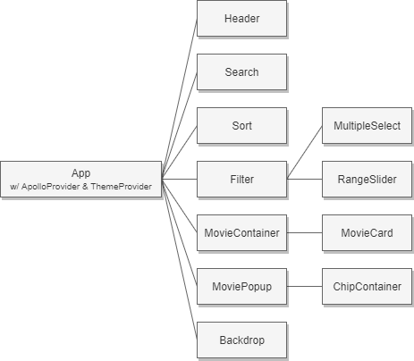

# MovDB 

MovDB er en applikasjon for informasjon om nærmere 3000 filmer. Den inneholder et søkegrensesnitt hvor man kan søke etter både tittel og beskrivelse. Videre kan man filtrere filmene etter sjanger, lanseringsår og varighet. De kan også sorteres etter rating, tittel (alfabetisk), varighet og lanseringsår, både i stigende og synkende rekkefølge. Resultatene presenteres i en listebasert visning, hvor man kan scrolle nedover for å laste inn flere. Hver film i listen kan trykkes på. Da vises en popup med mer informasjon om filmen og dens trailer.

### Systemkrav

For å kjøre applikasjonen lokalt er følgende nødvendig:

-   [Node.js](https://nodejs.org/en/download/)
-   [Expo CLI](https://docs.expo.io/workflow/expo-cli/) (installert globalt)
-   Expo Client på [iOS](https://apps.apple.com/app/apple-store/id982107779) eller [Android](https://play.google.com/store/apps/details?id=host.exp.exponent&referrer=www) (mobilenhet eller simulator)

### Installering og kjøring

Klon repoet:

```
git clone https://gitlab.stud.idi.ntnu.no/it2810-h20/team-23/runar/prosjekt-4.git
```

Naviger til rotmappen av prosjektet og installer avhengigheter:

```
npm install
```

Start Expo Developer Tools:

```
expo start
```

Et vindu i nettleseren vil åpnes, og herfra kan du kjøre applikasjonen på ønsket plattform. Merk at applikasjonen fungerer kun på iOS og Android.

### Teknologi

#### React Native og TypeScript

Prosjektet er initialisert gjennom Expo, med TypeScript som implementasjonsspråk. Det er brukt en strict versjon av TypeScript, hvor alle variabler, parametere og returverdier er typedefinert. Dette sikrer at man unngår typefeil under utvikling og det gir mer struktur til koden.

Komponentene som er implementert består hovedsakelig av kjernekomponentene som finnes i React Native. Her er det blant annet brukt view, scroll view, text, image og touchables, for å nevne noen. Det er også brukt flere [tredjepartskomponenter](#tredjepartskomponenter) for spesifikke elementer. Det overordnede komponenttreet er illustrert i figur 1. Hver komponent er dokumentert gjennom kommentarer i koden der det er følt at det er fornuftig for forståelsen.



_Figur 1: Applikasjonens komponenttre_

#### Gjenbruk av kode

React Native legger opp til mye gjenbruk av kode fra en vanlig React-applikasjon, som implementert i prosjekt 3. I frontend er tilnærmet all logikk for hver komponent gjenbrukbar, i tillegg til det brukte systemet for local state management (Apollo Client). Det er først og fremst erstatning av UI-komponenter, til kjernekomponenter i React Native og tredjepartskomponenter, som er den store forskjellen. Dette åpner opp for mobil-spesifikk oppførsel som ikke er mulig i en webapplikasjon. Likevel er strukturen til komponentene lik React-applikasjonens komponenter. Når det kommer til backend er denne fullt gjenbrukbar, da den fungerer som en separat enhet som serverer data. Både React-applikasjonen fra prosjekt 3 og denne React Native-applikasjonen bruker akkurat samme data på samme måte.

#### Tredjepartskomponenter

### Testing

### Git
